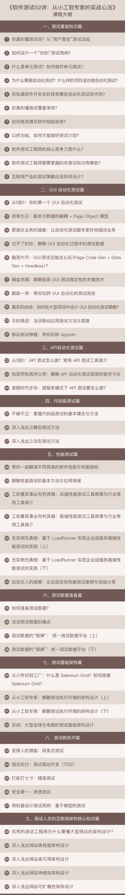

### 你将获得

* 从0系统掌握软件测试的知识要点；
* 主流测试技术的核心原理；
* 5大企业级项目实战案例解析；
* 从小工到测试专家的必备技能。

### 课程介绍

软件测试，可以说是软件开发的最后一道防线，也是产品上线前最为重要的一个环节。

软件测试看似简单，但要把软件测试做到极致，却并非易事。师傅领进门后，你需要不断地用知识武装自己，才能跟随技术发展的趋势，成为一名优秀的测试人。走在测试路上，如果你也遇到了这些问题：

1. 测试用例设计看似简单，却总是不够完备；
2. 软件的复杂度和更新迭代速度超乎想象，你需要寻找更高效的学习路径；
3. 自动化测试已成主流，但你的团队还停留在手工测试，困惑于怎么借助自动化测试工具提升团队效率；
4. 大量的测试框架和工具，让你不知所措，不知如何选择最适合自己项目的框架和工具；
5. 由Google等公司主导的“去QE，开发自己测试”的模式，让你不清楚自己未来职业该如何规划；

《软件测试52讲》这个课程的目标就是帮你解决这些困惑。

在这个课程里，茹炳晟将用通俗易懂的语言，以知其然知其所以然的思路，为你系统梳理软件测试的知识体系，深入讲解自动化测试、性能测试和测试架构设计的核心原理，助你从软件测试的“小工”进阶为“专家”。

同时，为了帮助你的测试方案落地，茹炳晟分享了一系列的行业最佳实践，这些实践案例也会为你构建一幅包括GUI/API自动化测试、测试数据平台、测试基础架构建设、性能/压力测试、代码级测试、测试新技术和大型网站架构等在内的软件测试技术全景视图。

本课程共包括五大模块，系统阐述了测试工程师必须具备的核心测试理念和技能。

* **软件测试技术篇**，将包括GUI自动化测试、API自动化测试、代码级测试和性能测试技术，通过理论结合实例的方式，为你讲述这四种测试技术的核心知识、设计思想，以及最佳实践。
* **测试架构篇**，将讲述测试数据准备与测试基础架构的内容，既有解决测试数据准备痛点的方案，又有大型互联网企业测试基础架构设计的最佳实践。
* **测试新技术篇**，将选取当下比较热门的探索式测试、测试驱动开发、精准测试、渗透测试技术和基于模型的测试，分别讲述它们解决的问题和具体的实现方法。

* ** 测试人员的互联网架构核心知识篇，** 将从高性能、高可用、伸缩性和可扩展性四个维度对大型网站架构进行深度剖析，弥补测试工程师相较与开发工程师以及测试架构师之间的鸿沟。

### 课程目录

### 讲师介绍

茹炳晟，具有 16 年的软件测试开发经验，先后任职于eBay 中国研发中心、HP软件中国研发中心、阿尔卡特朗讯和Cisco中国研发中心，**腾讯 TEG 基础架构部**。

茹炳晟精通软件全生命周期各个阶段的测试技术，并提倡“测试即服务”的理念。他曾负责建立全球大型电商网站的测试基础架构和和自动化测试方案，主持搭建持续集成测试生态体系和企业级测试基础架构，主持与参加过的测试项目几乎涵盖所有种类，包括嵌入式系统测试、金融平台单元测试、平台SDK测试、轨道交通安全软件测试、Web Service测试以及性能全链路压测等。

### 适合人群

想要系统学习互联网时代下软件测试技术的软件行业从业者；具有1~5年经验的软件测试工程师和测试开发工程师；测试架构师，及希望进阶测试架构师的测试人员；中小型，以及大型企业的测试工程师内训。
